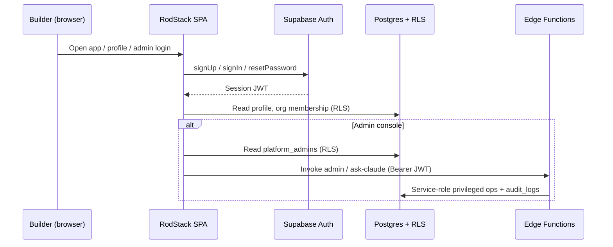
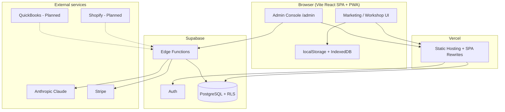
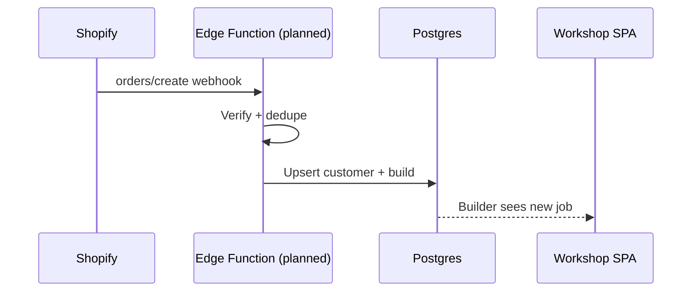
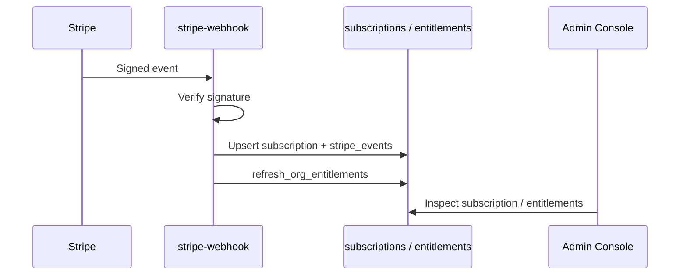
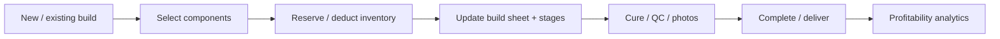

# RodStack Technology Stack and Software Architecture Overview

**Product:** RodStack — ERP and digital workbench for custom fishing rod builders  
**Document purpose:** Explain every major technology, service, integration, and software function in plain language for technical and nontechnical readers.  
**Accuracy rule:** Status labels reflect the **current repository and deployment design**. Planned or unconfigured systems are marked clearly. No secrets, passwords, or API keys are included.

**Important stack note:** Product briefs sometimes describe a Next.js frontend. The **shipped RodStack application in this repository** is a **Vite + React SPA** hosted on Vercel, talking to **Supabase** (PostgreSQL, Auth, Edge Functions, RLS). This document describes the **actual running architecture**, not a hypothetical Next.js rewrite.

---

## 1. Frontend Application

### Technology

| Technology | Role in RodStack |
| ---------- | ---------------- |
| **Vite** | Build tool and local development server; produces the static SPA bundle |
| **React** | Component UI for marketing, workshop, forms, and admin console |
| **TypeScript** | Typed foundation for new modules (`allowJs` for existing JSX); Zod schemas for validation |
| **Tailwind CSS** | Utility styling for mobile-first workshop and marketing layouts |
| **React Router** | Admin console routes (`/admin/*`) |
| **Hash / view routing** | Workshop app views (`#view=bench`, `#view=crm`, etc.) |
| **Progressive Web App (PWA)** | Service worker (`public/sw.js`) for basic offline/cache behavior |
| **Vercel** | Hosting, HTTPS, SPA rewrites, preview and production deployments |

### What the frontend is responsible for

| Function | How RodStack uses it |
| -------- | -------------------- |
| **User interface and navigation** | Marketing landing, onboarding, workshop shell, forms suite, and owner admin console |
| **Mobile-first workshop experience** | Bench and production views designed for phone use on the wrapping bench |
| **Responsive layouts** | Tailwind breakpoints for phone, tablet, and desktop |
| **Offline / low-connectivity support** | Local storage of workshop data, IndexedDB photo store, offline sync queue when cloud is unavailable |
| **Build sheets** | Digital build documentation and PDF/export tooling in the workshop modules |
| **Inventory screens** | SKU quantity, low-stock thresholds, and build-linked component usage |
| **Guide-spacing / spine tools** | Spine Finder and related calculator panels for blank setup |
| **Component compatibility** | Blueprint and technique-driven setup helpers (product UX; deeper “fit engine” is expanding) |
| **Workshop timers and status** | Cure trackers, order/stage status, and bench-mode UI |
| **Secure backend communication** | Supabase JS client with **anon key only**; privileged calls go through Edge Functions with the user JWT |
| **Hosting** | Static `dist/` deploy on Vercel with SPA rewrite so `/admin/login` deep-links work |

### Sign-in (users)

Workshop users sign in from the application profile/auth panel (not a dedicated `/login` page today).

**Sign in to RodStack:**  
[Open RodStack Sign In](https://rod-stack-ai-workbench-assistant.vercel.app/#view=profile)

*(Planned alias: `/login` → same auth experience. Current production entry is the profile view.)*

---

## 2. Backend and Database

### Technology

| Technology | Role in RodStack |
| ---------- | ---------------- |
| **Supabase** | Managed backend platform (Auth, Postgres, Edge Functions, project dashboard) |
| **PostgreSQL** | System of record for profiles, organizations, memberships, subscriptions, entitlements, audit logs, workspaces |
| **Supabase Auth** | Email/password registration, login, email verification, password reset, sessions |
| **Supabase Edge Functions** | Server-side privileged logic (admin APIs, Ask Claude proxy, Stripe webhook) |
| **Row Level Security (RLS)** | Database policies that isolate tenants and protect privileged tables |
| **Supabase Storage** | **Planned** for shared file/image hosting; photos today primarily use **IndexedDB** in the browser |
| **Realtime subscriptions** | **Planned** for live multi-device workshop boards; current sync is primarily load/upsert + local persistence |

### What the backend is responsible for

| Function | Status | Notes |
| -------- | ------ | ----- |
| User authentication | **Configured / Partially Implemented** in production until staging secrets fully verified | Supabase Auth + SPA session |
| Organization and account management | **Partially Implemented** | Orgs created on signup; membership roles enforced in schema |
| Platform-owner / admin permissions | **Partially Implemented** | `platform_admins` + Edge Function checks; requires promotion CLI |
| Customer vs builder data separation | **Partially Implemented** | Org membership + RLS; workshop payload still largely per-user workspace JSON |
| Secure database access | **Configured** (code) | Anon key + RLS; service role only on server |
| Rod build records | **Partially Implemented** | Stored in workspace payload / local platform data |
| Digital build sheets | **Partially Implemented** | Frontend modules + exports |
| Inventory records | **Partially Implemented** | Local/cloud workspace inventory SKUs |
| Bills of Materials | **Planned / Partial** | Cost fields and inventory deduction exist; full BOM accounting sync is planned |
| Component specifications | **Partially Implemented** | Blueprint / build record model |
| Supplier information | **Partially Implemented** | Inventory SKU supplier fields |
| File and image storage | **Partial** | Photos in IndexedDB; Supabase Storage planned |
| Realtime workshop updates | **Planned** | Not the primary path today |
| Server-side business logic | **Partially Implemented** | Edge Functions for admin, AI, Stripe |
| API key / secret management | **Configured** (design) | Vercel `VITE_*` public only; Supabase secrets for server keys |

### Dashboards

[Open Supabase Dashboard](INSERT_SUPABASE_PROJECT_URL_HERE)

---

## 3. Authentication and User Access

### Complete authentication flow

1. **Registration** — User creates an account with email, password, builder name, and shop name (Supabase Auth `signUp`, with metadata for workshop identity).
2. **Email verification** — Recommended; confirmation updates `profiles.email_verified_at` via database trigger when enabled in Supabase Auth settings.
3. **Email/password login** — Supabase `signInWithPassword`; session stored by the Supabase client.
4. **OAuth 2.0 login** — **Planned** (not wired as a primary path in the current SPA). Supabase can host Google/GitHub providers when enabled in the dashboard.
5. **Password recovery** — `resetPasswordForEmail` from the auth panel; user sets a new password when authenticated.
6. **Session management** — Supabase session refresh; production builds **require** Supabase (local demo auth is disabled when `PROD`).
7. **Protected application routes** — Workshop features remain available locally; **admin routes** require auth + `platform_admins` role via `ProtectedRoute` and Edge Function checks.
8. **Platform-owner access** — Rows in `platform_admins` (`platform_owner`, `support_admin`, `read_only_support`), promoted only via service-role CLI / SQL RPC (not a client page).
9. **Organization-level roles** — `owner`, `admin`, `builder`, `viewer` on `organization_members`.
10. **Employee / workshop-user roles** — Same org role model; day-to-day builders typically use `builder` / `viewer`.
11. **RLS enforcement** — Policies on profiles, orgs, memberships, subscriptions, entitlements, audit logs, workspaces; privileged writes go through Edge Functions with the service role.

### Sign-in links

**Sign in to RodStack:**  
[Open RodStack Sign In](https://rod-stack-ai-workbench-assistant.vercel.app/#view=profile)

**Administrator sign in:**  
[Open RodStack Admin Sign In](https://rod-stack-ai-workbench-assistant.vercel.app/admin/login)

Primary user auth UI today: **`#view=profile`** (and in-app auth overlay).  
Platform-owner console: **`/admin/login`**.

---

## 4. AI Services

### Technology

| Technology | Role |
| ---------- | ---- |
| **Anthropic Claude API** | Large language model for workshop/admin assistance |
| **Secure server-side AI proxy** | Supabase Edge Function `ask-claude` (JWT + platform admin + rate limits) |
| **Optional OpenAI** | **Planned** — not implemented; `VITE_OPENAI_*` is forbidden |

### Functions and status

| Function | Status |
| -------- | ------ |
| Rod-building assistant (owner console) | **Awaiting Configuration** — code ready (`/admin/ask` + `ask-claude`); requires `ANTHROPIC_API_KEY` secret + deployed function |
| Build-sheet recommendations | **Awaiting Configuration** (same proxy; prompt/context driven) |
| Component compatibility explanations | **Awaiting Configuration** |
| Inventory insights | **Awaiting Configuration** |
| Bill of Materials generation | **Planned** |
| Guide-train / Fuji KR guidance | **Planned** / prompt-capable when AI is configured |
| Blank, reel seat, grip, guide analysis | **Planned** / prompt-capable when context is supplied |
| Workshop troubleshooting | **Awaiting Configuration** |
| Secure API key handling | **Configured** in code — key never uses `VITE_*`; never returned to the browser |
| Usage limits and error handling | **Configured** in code — length limits, model allowlist, timeout, rate limit, typed error codes |
| In-app “AI Extraction” scraper | **Disabled / Simulated** — demo timer only; not a live LLM |

**Do not treat Ask Claude as Production until secrets are set, the function is deployed, and a platform admin has successfully completed a live request.**

Admin AI entry: [Open Ask Claude (Admin)](https://rod-stack-ai-workbench-assistant.vercel.app/admin/ask)

---

## 5. Shopify Integration

### Technology (target)

- Shopify Admin API  
- Shopify webhooks  
- OAuth or secure API credentials (server-only)

### Functions and status

| Function | Status |
| -------- | ------ |
| Import custom rod orders | **Planned** |
| Sync customer information | **Planned** |
| Import product configurations | **Planned** |
| Update order status | **Planned** |
| Sync available inventory | **Planned** |
| Reserve components for active builds | **Planned** |
| Order-created / order-updated webhooks | **Planned** |
| Duplicate import prevention | **Planned** |
| Integration error / retry logging | **Planned** (audit log pattern exists for other systems) |

**Current status: Planned.** No Shopify Admin API client or webhooks exist in this repository.

[Open Shopify Admin](INSERT_SHOPIFY_ADMIN_URL_HERE)

---

## 6. QuickBooks Integration

### Technology (target)

- QuickBooks Online API  
- OAuth 2.0  
- QuickBooks webhooks  

### Functions and status

| Function | Status |
| -------- | ------ |
| Material-cost synchronization | **Planned** |
| Bills of Materials accounting | **Planned** |
| Vendor / supplier records | **Planned** (supplier fields exist in inventory UI only) |
| Customer invoice creation | **Planned** |
| Expense categorization | **Planned** |
| Cost-of-goods tracking | **Partial** locally in analytics UI; not synced to QBO |
| Build profitability calculations | **Partial** (in-app Profit Dashboard) |
| Payment / invoice status updates | **Planned** |
| Webhook processing | **Planned** |
| Error handling and reconciliation | **Planned** |

**Current status: Planned.**

[Open QuickBooks](https://qbo.intuit.com/)

---

## 7. Stripe Billing

### Technology

| Technology | Role |
| ---------- | ---- |
| **Stripe Checkout / Billing / Customer Portal** | Target billing UX (**Awaiting Configuration** / not fully productized in SPA) |
| **Stripe webhooks** | Edge Function `stripe-webhook` with signature verification |
| **RodStack subscription tables** | `subscriptions`, `subscription_overrides`, `feature_entitlements`, `stripe_events` |

### Functions and status

| Function | Status |
| -------- | ------ |
| Subscription plan selection UI | **Planned / Awaiting Configuration** |
| Recurring billing | **Awaiting Configuration** (depends on Stripe + webhook deploy) |
| Trial management | **Partially Implemented** (schema fields such as `trial_end`) |
| Subscription status synchronization | **Partially Implemented** — webhook handler + reconcile CLI in repo |
| Payment failure handling | **Partially Implemented** (`invoice.payment_failed` → `past_due`) |
| Plan upgrades / downgrades | **Partially Implemented** via subscription updated events + admin overrides |
| Customer billing portal | **Awaiting Configuration** |
| Webhook verification | **Configured** in code (HMAC Stripe signature) |
| Link Stripe customers to organizations | **Partially Implemented** — requires `organization_id` metadata on Checkout/Subscription |
| Feature restriction by entitlement | **Partially Implemented** — `feature_entitlements` + tier refresh RPC |

**Overall Stripe status: Partially Implemented (code) / Awaiting Configuration (deployed secrets, webhook endpoint, Checkout UI).**

[Manage RodStack Subscription](INSERT_STRIPE_CUSTOMER_PORTAL_URL_HERE)

---

## 8. Deployment and Hosting

### Technology

| Technology | Role |
| ---------- | ---- |
| **Vercel** | SPA hosting, HTTPS, previews, production |
| **Supabase production/staging projects** | Auth, DB, Edge Functions |
| **GitHub** | Source control and PR workflow |
| **Environment variables** | Split: public `VITE_*` on Vercel; secrets in Supabase / local shell |
| **Preview and staging** | Vercel Preview + separate Supabase staging project (recommended) |

### Functions

| Function | How it works |
| -------- | ------------ |
| Source-code management | GitHub repository |
| Branch / PR workflow | Pull requests → review → merge to main |
| Automatic deployments | Vercel builds on git push (when project is connected) |
| Preview deployments | Per-PR URLs |
| Production deployments | Production branch deploy |
| Environment separation | Staging vs production Supabase + Vercel env |
| Secure secret storage | Never commit `.env`; no secrets in `VITE_*` |
| Database migrations | `supabase/migrations/*` via `supabase db push` |
| Edge Function deployment | `npm run deploy:staging` / `supabase functions deploy` |
| Monitoring failures | Vercel deploy logs + Supabase function logs |
| Rollback | Vercel instant rollback to prior deployment |

### Links

[Open Production Application](https://rod-stack-ai-workbench-assistant.vercel.app/)

[Open Vercel Dashboard](INSERT_VERCEL_PROJECT_URL_HERE)

[Open GitHub Repository](https://github.com/swehrcustoms/RodStack_AI_Workbench_Assistant)

[Open Supabase Dashboard](INSERT_SUPABASE_PROJECT_URL_HERE)

---

## 9. Core RodStack Software Modules

Each module lists purpose, primary users, inputs, outputs, connected systems, and status.

### Customer Relationship Management

| | |
| --- | --- |
| **Purpose** | Track customers, quotes, and relationships for custom builds |
| **Primary users** | Shop owners, builders (`owner` / `admin` / `builder`) |
| **Inputs** | Customer name, contact, linked builds |
| **Outputs** | CRM list/stats in-app |
| **Connected systems** | Workspace data, optional future Shopify customers |
| **Status** | **Partially Implemented** |

### Custom Rod Order Management

| | |
| --- | --- |
| **Purpose** | Track build order stages from intake to delivery |
| **Primary users** | Builders, shop managers |
| **Inputs** | Build records, stage timestamps, statuses |
| **Outputs** | Production status, CRM open/in-progress counts |
| **Connected systems** | Inventory deduction, future Shopify orders |
| **Status** | **Partially Implemented** |

### Digital Build Sheets

| | |
| --- | --- |
| **Purpose** | Document blank, guides, wraps, specs for a custom rod |
| **Primary users** | Rod builders |
| **Inputs** | Blueprint/SKU data, measurements, notes |
| **Outputs** | On-screen sheet, PDF/export |
| **Connected systems** | Photos, inventory, AI (when configured) |
| **Status** | **Partially Implemented** |

### Component Inventory

| | |
| --- | --- |
| **Purpose** | Track blanks, guides, thread, epoxy stock and low thresholds |
| **Primary users** | Shop owners, builders |
| **Inputs** | SKU, qty, cost, supplier |
| **Outputs** | Low-stock counts, deductions on builds |
| **Connected systems** | Future Shopify/QuickBooks |
| **Status** | **Partially Implemented** |

### Supplier Management

| | |
| --- | --- |
| **Purpose** | Associate inventory with suppliers/URLs |
| **Primary users** | Shop owners |
| **Inputs** | Supplier name/URL on SKUs |
| **Outputs** | Inventory enrichment |
| **Connected systems** | Future QuickBooks vendors |
| **Status** | **Partially Implemented** (lightweight fields) |

### Bills of Materials

| | |
| --- | --- |
| **Purpose** | List components consumed per build for cost and purchasing |
| **Primary users** | Shop owners |
| **Inputs** | Component SKUs on builds |
| **Outputs** | Cost basis for profitability |
| **Connected systems** | Inventory, future QuickBooks |
| **Status** | **Planned / Partial** |

### Rod Cost and Profitability Tracking

| | |
| --- | --- |
| **Purpose** | Understand margin per build and shop analytics |
| **Primary users** | Shop owners |
| **Inputs** | Costs, quotes, completed builds |
| **Outputs** | Profit dashboard charts |
| **Connected systems** | Inventory costs; future QBO |
| **Status** | **Partially Implemented** |

### Guide Spacing and Static-Test Calculator

| | |
| --- | --- |
| **Purpose** | Support spine finding and guide layout decisions |
| **Primary users** | Builders on the bench |
| **Inputs** | Blank measurements, technique |
| **Outputs** | Calculator results / notes |
| **Connected systems** | Build sheets |
| **Status** | **Partially Implemented** (Spine Finder panel) |

### Component Compatibility and Fit Engine

| | |
| --- | --- |
| **Purpose** | Reduce mismatched blank/reel seat/grip/guide combinations |
| **Primary users** | Builders |
| **Inputs** | Component specs, technique tags |
| **Outputs** | Compatibility guidance |
| **Connected systems** | AI assistant (when configured) |
| **Status** | **Planned / Partial** |

### Reel Seat Arbor Calculator

| | |
| --- | --- |
| **Purpose** | Size arbors for reel seat installs |
| **Primary users** | Builders |
| **Inputs** | Blank OD, seat ID |
| **Outputs** | Arbor dimensions |
| **Connected systems** | Build sheets |
| **Status** | **Planned** |

### Guide Train Configuration

| | |
| --- | --- |
| **Purpose** | Configure spinning/casting guide trains (e.g. KR Concept) |
| **Primary users** | Builders |
| **Inputs** | Platform, blank length, guide kits |
| **Outputs** | Guide schedule |
| **Connected systems** | Inventory, AI guidance |
| **Status** | **Planned / Partial** |

### Workshop Production Board

| | |
| --- | --- |
| **Purpose** | See work-in-progress across builds |
| **Primary users** | Shop floor |
| **Inputs** | Order statuses |
| **Outputs** | Bench / vault / CRM views |
| **Connected systems** | Realtime (**Planned**) |
| **Status** | **Partially Implemented** |

### Epoxy Cure Timers

| | |
| --- | --- |
| **Purpose** | Track epoxy/finish cure windows |
| **Primary users** | Builders |
| **Inputs** | Start time, product |
| **Outputs** | Cure status |
| **Connected systems** | Build stages |
| **Status** | **Partially Implemented** (Cure Tracker) |

### Thread and Trim Configuration

| | |
| --- | --- |
| **Purpose** | Document wrap colors, trim bands, patterns |
| **Primary users** | Builders |
| **Inputs** | Thread SKUs, notes, photos |
| **Outputs** | Build sheet detail |
| **Connected systems** | Photos, inventory |
| **Status** | **Partially Implemented** |

### Quality-Control Checklists

| | |
| --- | --- |
| **Purpose** | Standardize inspection before delivery |
| **Primary users** | Builders, QC |
| **Inputs** | Checklist items, pass/fail |
| **Outputs** | QC record on build |
| **Connected systems** | Build sheets, photos |
| **Status** | **Planned** |

### File and Image Attachments

| | |
| --- | --- |
| **Purpose** | Capture build photos and shop logos |
| **Primary users** | Builders |
| **Inputs** | Camera/files |
| **Outputs** | IndexedDB photo log; profile logo data URLs |
| **Connected systems** | Future Supabase Storage |
| **Status** | **Partially Implemented** |

### Shopify Order Sync

| | |
| --- | --- |
| **Purpose** | Pull storefront custom-rod orders into RodStack |
| **Status** | **Planned** |

### QuickBooks Accounting Sync

| | |
| --- | --- |
| **Purpose** | Push costs/invoices to accounting |
| **Status** | **Planned** |

### Stripe Subscription Management

| | |
| --- | --- |
| **Purpose** | Bill shops for RodStack plans and gate features |
| **Primary users** | Platform owner, shop owners |
| **Inputs** | Stripe events, org metadata |
| **Outputs** | `subscriptions` / entitlements |
| **Connected systems** | Stripe webhook Edge Function, admin overrides |
| **Status** | **Partially Implemented / Awaiting Configuration** |

### AI Rod-Building Assistant

| | |
| --- | --- |
| **Purpose** | Answer workshop and subscription troubleshooting questions |
| **Primary users** | Platform owners / support admins |
| **Inputs** | Prompt + optional context via `/admin/ask` |
| **Outputs** | Claude reply (server-proxied) |
| **Connected systems** | Anthropic via `ask-claude` |
| **Status** | **Awaiting Configuration** |

### Platform Administration

| | |
| --- | --- |
| **Purpose** | Search users, inspect subscriptions, previews, support view, entitlements, audit |
| **Primary users** | `platform_owner`, `support_admin`, `read_only_support` |
| **Inputs** | Admin JWT + Edge Function calls |
| **Outputs** | Troubleshooting actions + audit trail |
| **Connected systems** | Supabase Auth, Edge Functions |
| **Status** | **Partially Implemented** (deploy + promote owner required) |

### Audit Logs and Integration Logs

| | |
| --- | --- |
| **Purpose** | Record privileged admin and Stripe processing events |
| **Primary users** | Platform admins |
| **Inputs** | Edge Function actions, webhook processing |
| **Outputs** | `audit_logs`, `stripe_events` |
| **Connected systems** | Admin console Audit page |
| **Status** | **Partially Implemented** |

---

## 10. System Data Flow

### High-level system architecture

### 1. User login → authenticated session

1. User opens RodStack and chooses Sign In / Sign Up.  
2. SPA calls Supabase Auth.  
3. JWT session is established in the browser client.  
4. SPA loads `profiles`, org memberships, and (for admins) `platform_admins`.  
5. Workshop data loads from local storage and/or `rodstack_workspaces` under RLS.

### 2. Shopify order → RodStack build record *(Planned)*

1. Shopify fires `orders/create` webhook to a future Edge Function.  
2. Function verifies authenticity and deduplicates by Shopify order id.  
3. Customer and line items map into a RodStack build/order record.  
4. Builder sees the job on the production board.

### 3. Rod build → component reservation

1. Builder advances a build and associates component SKUs.  
2. Inventory quantities decrement in workspace data.  
3. Low-stock indicators update in the UI.  
4. *(Planned)* reservations sync to Shopify/QBO.

### 4. Inventory usage → Bill of Materials *(Partial / Planned accounting sync)*

1. Components consumed on a build form a BOM list.  
2. Unit costs roll into profitability views.  
3. *(Planned)* BOM posts to QuickBooks as COGS/expense.

### 5. Bill of Materials → QuickBooks *(Planned)*

1. Completed build triggers accounting export job.  
2. OAuth-authenticated QBO API creates invoice/expense artifacts.  
3. Failures land in integration/audit logs for retry.

### 6. Stripe subscription event → entitlements

1. Stripe sends a signed webhook to `stripe-webhook`.  
2. Event id is stored in `stripe_events` (idempotent).  
3. `subscriptions` row upserts for the organization.  
4. `refresh_org_entitlements` recalculates feature flags.  
5. Admin console and future feature gates read entitlements.

### 7. User question → secure AI proxy

1. Platform admin opens `/admin/ask` and submits a prompt.  
2. SPA invokes `ask-claude` with the user JWT (no Anthropic key).  
3. Function checks platform role, rate limits, and payload size.  
4. Anthropic Messages API is called with server secret + allowlisted model.  
5. Reply returns to the UI; audit log records metadata only (not full secrets).

### 8. Workshop update → realtime UI *(Planned path)*

1. Builder updates a build on device A.  
2. Change persists locally and upserts cloud workspace.  
3. *(Planned)* Realtime channel notifies device B to refresh.

### Shopify order synchronization *(target)*

### Stripe subscription synchronization

### Rod build and inventory workflow

---

## 11. Integration Status Table

| System | Primary Function | Authentication Method | Current Status | Sign-In or Dashboard Link |
| ------ | ---------------- | --------------------- | -------------- | ------------------------- |
| RodStack | Custom rod ERP / workbench SPA | Supabase Auth (email/password) | **Partially Implemented** (production SPA live; cloud features env-dependent) | [Open RodStack](https://rod-stack-ai-workbench-assistant.vercel.app/) |
| RodStack Admin | Platform owner troubleshooting console | Supabase Auth + `platform_admins` | **Partially Implemented** | [Admin Sign In](https://rod-stack-ai-workbench-assistant.vercel.app/admin/login) |
| Supabase | Auth, Postgres, RLS, Edge Functions | Dashboard login + project API keys | **Configured** (project-specific) | [Supabase Dashboard](INSERT_SUPABASE_PROJECT_URL_HERE) |
| Vercel | SPA hosting and deployments | Vercel account SSO | **Production** (app hosted) | [Vercel Dashboard](INSERT_VERCEL_PROJECT_URL_HERE) |
| GitHub | Source control | GitHub OAuth/SSH | **Production** | [GitHub Repository](https://github.com/swehrcustoms/RodStack_AI_Workbench_Assistant) |
| Shopify | Storefront order/inventory sync | OAuth / Admin API (planned) | **Planned** | [Shopify Admin](INSERT_SHOPIFY_ADMIN_URL_HERE) |
| QuickBooks | Accounting sync | OAuth 2.0 (planned) | **Planned** | [QuickBooks](https://qbo.intuit.com/) |
| Stripe | Subscription billing sync | Webhook secret + Stripe keys (server) | **Partially Implemented** / **Awaiting Configuration** | [Stripe Customer Portal](INSERT_STRIPE_CUSTOMER_PORTAL_URL_HERE) |
| Anthropic | Claude AI assistant | Server secret via Edge Function | **Awaiting Configuration** | N/A (no end-user Anthropic login; use [Admin Ask Claude](https://rod-stack-ai-workbench-assistant.vercel.app/admin/ask)) |

---

## Security summary (non-secret)

- Browser may only hold **public** config (`VITE_SUPABASE_URL`, `VITE_SUPABASE_ANON_KEY`, optional publishable Stripe key).  
- **Service role**, **Anthropic**, and **Stripe secret/webhook** keys stay in Supabase secrets or local server shells.  
- Admin password gates and `VITE_*` secrets are **removed / forbidden**.  
- Platform owner promotion is **service-role only** (`npm run admin:promote-owner`).

Related docs: [AUTH_SETUP.md](./AUTH_SETUP.md), [STAGING_CHECKLIST.md](./STAGING_CHECKLIST.md), [ARCHITECTURE.md](./ARCHITECTURE.md), [SECURITY_AUDIT.md](./SECURITY_AUDIT.md), [ENVIRONMENT_VARIABLES.md](./ENVIRONMENT_VARIABLES.md).

---

## Quick Access Links

| Destination | Link |
| ----------- | ---- |
| Production application | [Open Production Application](https://rod-stack-ai-workbench-assistant.vercel.app/) |
| User sign in | [Open RodStack Sign In](https://rod-stack-ai-workbench-assistant.vercel.app/#view=profile) |
| Administrator sign in | [Open RodStack Admin Sign In](https://rod-stack-ai-workbench-assistant.vercel.app/admin/login) |
| Admin Ask Claude | [Open Ask Claude](https://rod-stack-ai-workbench-assistant.vercel.app/admin/ask) |
| Vercel dashboard | [Open Vercel Dashboard](INSERT_VERCEL_PROJECT_URL_HERE) |
| GitHub repository | [Open GitHub Repository](https://github.com/swehrcustoms/RodStack_AI_Workbench_Assistant) |
| Supabase dashboard | [Open Supabase Dashboard](INSERT_SUPABASE_PROJECT_URL_HERE) |
| Shopify admin | [Open Shopify Admin](INSERT_SHOPIFY_ADMIN_URL_HERE) |
| QuickBooks | [Open QuickBooks](https://qbo.intuit.com/) |
| Stripe customer portal | [Manage RodStack Subscription](INSERT_STRIPE_CUSTOMER_PORTAL_URL_HERE) |

Replace every `INSERT_*_HERE` placeholder with your real dashboard URLs when available. Never paste API keys, service-role keys, webhook secrets, or passwords into this document.
